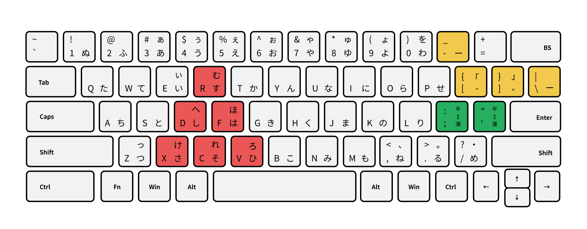

# カナ配列 for USキーボード

## 「さんかく」カナ配列

USキーボードに合わせて、JIS配列から記号キーと一部のカナの位置を調整した、かな入力用配列です。Google日本語変換 (Google IME Japanese) で利用することができます。JISからの変更点が三角形になっているので「さんかく」カナ配列と呼んでいます。

- 配列データ - [romantable-sankaku-jis.txt](https://raw.githubusercontent.com/cognitom/kana/master/romantable-sankaku-jis.txt)
- キーマップ - [keymap-recommended.txt](https://raw.githubusercontent.com/cognitom/kana/master/keymap-recommended.txt)

配列データをダウンロードして、IMEの設定画面から読み込むと使えます。

キーマップの使用は任意ですが、<kbd>INSERT</kbd>にIMEのON/OFFを割り振り、<kbd>変換</kbd>などUS配列に存在しないキーを省いたものです。[Change Key](https://forest.watch.impress.co.jp/library/software/changekey/)などを使って、<kbd>Caps</kbd> と <kbd>Insert</kbd> を入れ替えておくとより便利です。

- 一部のカナ(キーボードの右端のキー)を左手のシスト側に割り振り
  - <kbd>す</kbd> → <kbd>む</kbd> / <kbd>し</kbd> → <kbd>へ</kbd> / <kbd>は</kbd> → <kbd>ほ</kbd> / <kbd>さ</kbd> → <kbd>け</kbd> / <kbd>そ</kbd> → <kbd>れ</kbd> / <kbd>ひ</kbd> → <kbd>ろ</kbd>
  - 変更は三角形の範囲に限定し、文字形の似ているものに
  - 左手でシフトキーと合わせて押しやすい範囲
- カギ括弧と長音をUS配列で自然な位置に
- 濁点・半濁点・小文字のトグル (<kbd>'</kbd>で「は」「ば」「ぱ」をトグル)

## 「はんそく」カナ配列

JIS配列から最低限の変更にとどめた配列です。特徴的なキーにちなんで「はんそく」カナ配列と呼んでいます。詳しくは[こちらのブログ記事](https://medium.com/@cognitom/good-bye-japanese-keyboard-9b0418f32e2c)を参照してください。

- 配列データ - [romantable-hansoku-jis.txt](https://raw.githubusercontent.com/cognitom/kana/master/romantable-hansoku-jis.txt)
- キーマップ - [keymap-recommended.txt](https://raw.githubusercontent.com/cognitom/kana/master/keymap-recommended.txt)

※この配列から、小型キーボードでの使い勝手を改良したのが「さんかく」カナ配列です。

## 参考

- [新JIS用の配列](https://gist.github.com/ytomino/3610371) by ytomino
