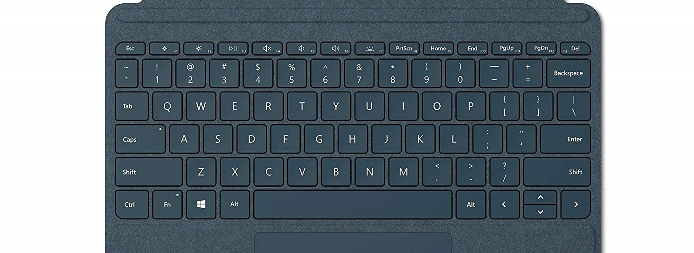
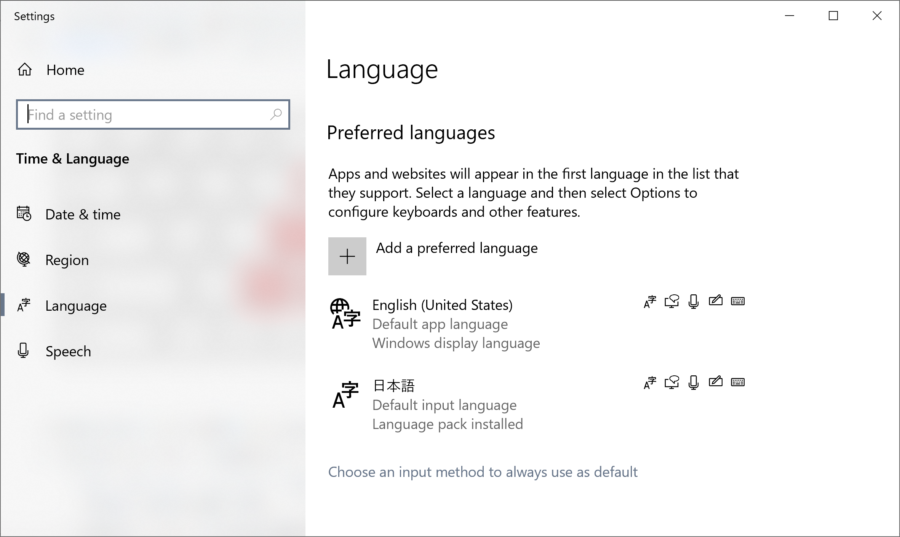
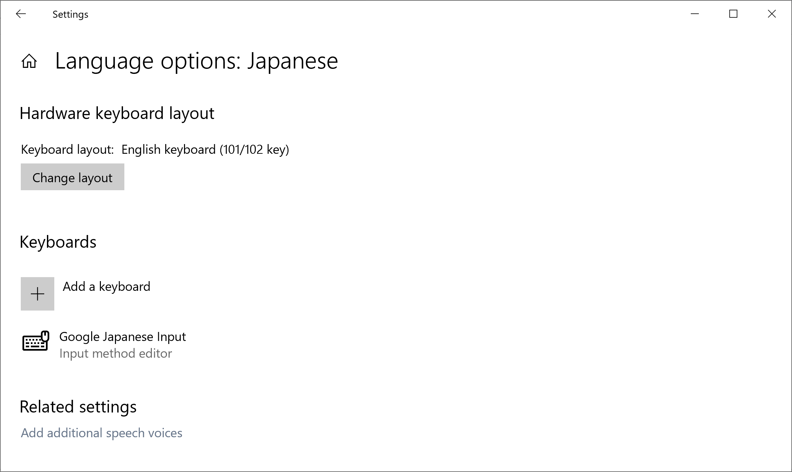
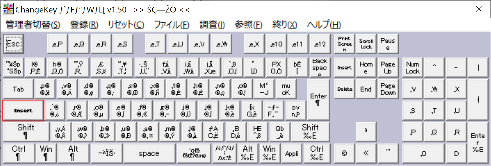

# 推奨セットアップ方法

## USキーボードを入手

- 一体型でも外付けでも構いません。上記に類する配列のキーボードが必要です。まれに小型のものでファンクションと数字の段を省略した4段のものも存在しますが、かな入力には適しません。5段、または6段のものを選んでください。
- カナ刻印はありませんが、割と指が覚えていますから大丈夫です。

## Google 日本語入力 (Google IME Japanese) のインストール

未導入であれば、ダウンロードしてきてインストールします。Windows版および、Mac版があります。

- [https://www.google.co.jp/ime/](https://www.google.co.jp/ime/)

※Linuxについては未検証ですが、[mozc](https://github.com/google/mozc)でも動くはずです。
※Android版については、ローマ字テーブルが固定となっているため、そのままでは導入できません。オープンソース版をカスタマイズしてコンパイルする必要がありそうです。

## 配列データのインポートと、IME設定

...執筆中

## Windowsの設定

Windows上で日本語入力の際に使うキーボードの配列を設定します。

言語設定の画面から、日本語の部分をクリックし「オプション(Options)」ボタンをクリックします。

キーボード配列を確認します。「English keyboard (101/102 key)」となっていればOKです。もし、日本語キーボードが選択されていたら、レイアウト変更(Change Layout)ボタンをクリックして、「English keyboard (101/102 key)」を選択します。

※Macの場合、物理キーボードごとに配列を設定できるのですが、Windowsの場合、配列は入力方法ごとに固定されてしまいます。つまり、配列の異なる複数のキーボードを接続することは想定されていません。外付けキーボードをつなぐ際は注意が必要です。

## Change Key のインストール

USキーボードは多言語での使用を想定していないため、言語や文字種の切り替えのためのキー(JISキーボードでいうところの半角全角キー)がありません。そこで、前項では、使われないキーの代表格の<kbd>Insert</kbd>にIMEのON/OFFに割り当てました。

ただ、<kbd>Insert</kbd>はたいてい押しにくいところに追いやられています(上記写真のSurface Keyboardだと、<kbd>Fn</kbd>+<kbd>Del</kbd>)。そのままでは、使いにくいので、キーの位置を<kbd>Caps</kbd>と入れ替えます。

いくつか方法がありますが、ここではWindowsを前提に、ChangeKeyというシェアウェアを使う方法を紹介します。まずは、下記サイトからダウンロードしてきましょう。インストールの必要はありません。解凍しておけば準備OKです。

- [https://forest.watch.impress.co.jp/library/software/changekey/](https://forest.watch.impress.co.jp/library/software/changekey/)

1. 解凍したフォルダ内の`ChgKey.exe`を右クリックして、「管理者として実行 (Run as administrator)」を選択
2. 表示されたウィンドウ(薄紫色)内から、<kdb>Caps Lock</kdb>をクリック
3. ポップアップ(薄緑色)が開くので、<kdb>Insert</kdb>をクリック
4. 登録メニューをクリック ※続けてWindowsが再起動されます。

なお、Windowsに日本語環境をインストールしていないと、上記スクリーンショットのように文字化けしますが、使用上問題はありません。

